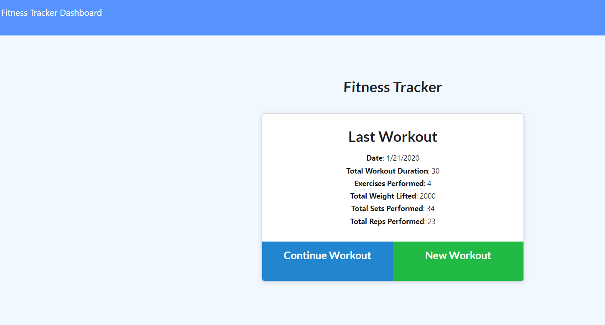
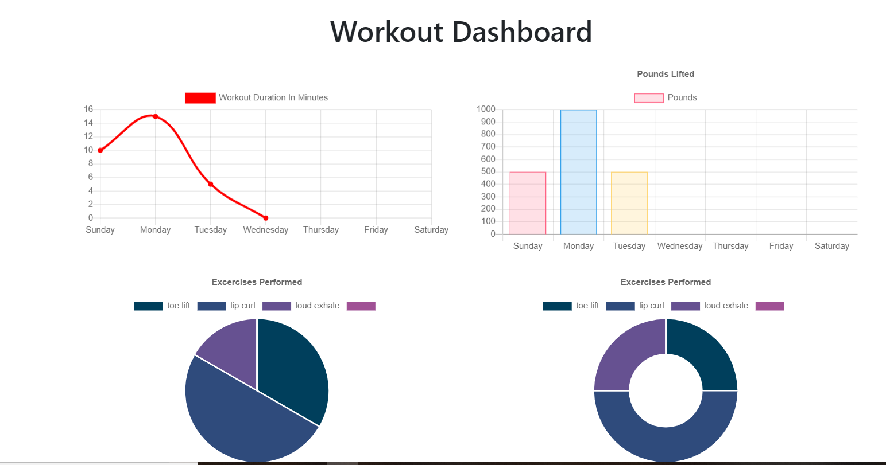

# Workout-Tracker
Built a Moongoose/MongoDB back end to a workout tracker with a pre-build front end as a homework assignment.  

## Live site: 
Live Heroku link: https://mongo-workout-tracker.herokuapp.com/ 

##Screenshots

## Challenges: 
This assignment required me to parse through a fairly complex front-end to find out what routes were being used and what information was 
being passed to those routes. 
